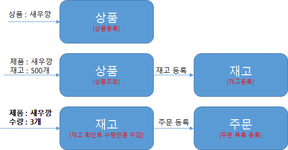

# 🚀 Inventory & Order Management System
> **Event-Driven Architecture & Multi-Module Study Project**

이 프로젝트는 단일 모듈의 레이어드 아키텍처에서 시작하여, **멀티 모듈 구조**와 **이벤트 기반 아키텍처(EDA)**로 확장하고, 최종적으로 다양한 **Lock 메커니즘**을 통해 동시성 문제를 해결하는 과정을 단계별 브랜치로 기록한 학습용 프로젝트입니다.

---

## 📌 학습 목표
* **EDA (Event Driven Architecture)**: 서비스 간 결합도를 낮추고 확장성을 높이는 설계 학습
* **Multi-Module Project**: 공통 로직 재사용성 및 도메인별 책임 분리를 위한 모듈화 전략 습득
* **Concurrency Control**: 데이터 정합성을 보장하기 위한 다양한 동시성 제어 기법 비교 및 구현

## 🛠 Tech Stack
- **Framework**: Spring Boot
- **Persistence**: JPA (Spring Data JPA)
- **Architecture**: Multi-Module, EDA, AutoConfiguration
- **Concurrency**: Optimistic Lock, Pessimistic Lock, Distributed Lock (Redis)

---

## 🏗 비즈니스 시나리오
시스템은 상품의 유통과 주문 과정을 아래와 같은 단계로 수행합니다.


1. **상품 등록**: 판매할 상품의 기본 정보 생성
2. **재고 등록**: 각 상품에 대한 초기 수량(Stock) 할당
3. **주문 (Order)**: 상품 주문 시 재고를 확인하고 차감 (※ 동시성 제어 핵심 로직)

---

## 🌿 Branch Roadmap

### Phase 1. Structural Evolution
| Branch | 설명 | 주요 특징 |
| :--- | :--- | :--- |
| **`v1`** | **단일 프로젝트 + 레이어드 구조** | 전형적인 3-Tier 아키텍처로 빠른 초기 개발에 집중 |
| **`v2`** | **단일 프로젝트 + 이벤트 기반 구조** | `ApplicationEventPublisher`를 통한 도메인 간 결합도 완화 |
| **`v3`** | **멀티 모듈 프로젝트 + 이벤트 기반** | `core`, `domain`, `api` 모듈 분리 및 `AutoConfiguration` 활용 |

### Phase 2. Concurrency Solution (동시성 문제 해결)
재고 차감 시 발생하는 **Race Condition**을 해결하기 위해 단계별로 접근합니다.

| Branch | 해결 방법 | 특징 |
| :--- | :--- | :--- |
| **`v4`** | **낙관적 락 (Optimistic Lock)** | JPA `@Version` 활용, 충돌이 적은 환경에 적합 |
| **`v5`** | **비관적 락 (Pessimistic Lock)** | DB `SELECT FOR UPDATE` 활용, 데이터 무결성 보장 |
| **`v6`** | **분산 락 (Distributed Lock)** | **Redis(Redisson)** 활용, 분산 서버 환경에서의 원자성 보장 |

---

## 🚦 시작하기

### Prerequisites
- Java 17+
- Redis (v6 테스트 시 필요)

### Execution
```bash
# 레포지토리 클론
git clone [https://github.com/your-username/your-repo-name.git](https://github.com/your-username/your-repo-name.git)

# 브랜치 이동 예시
git checkout v6

# 빌드 및 실행
./gradlew clean build
java -jar build/libs/*.jar